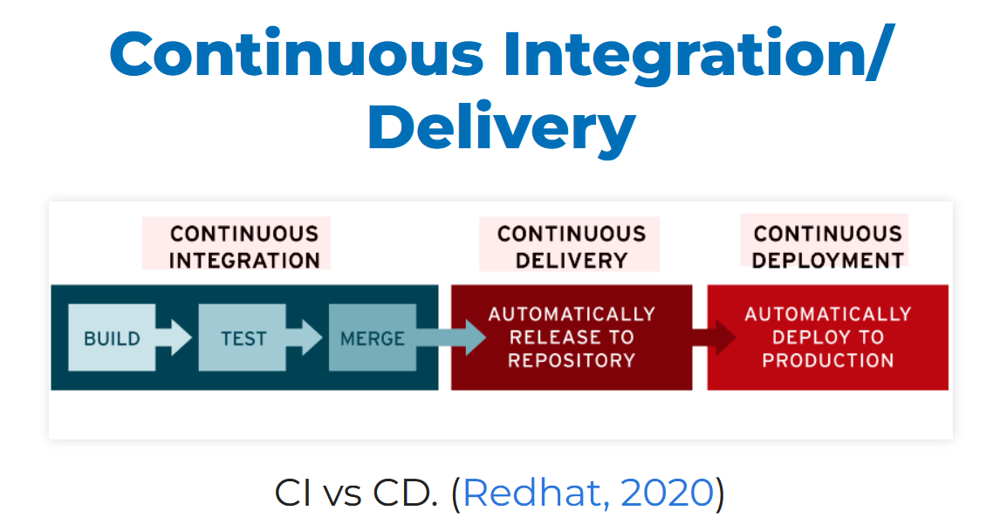

# Jenkins and Docker Lab Assignment Cheatsheet

## Jenkins Pipeline Overview
- **Pipeline Definition**: A Jenkins Pipeline automates the process of building, testing, and deploying applications.



### Key Components
- **Agent**: Defines where the pipeline runs (e.g., `agent any`).
- **Triggers**: Automated actions that start the pipeline (e.g., `pollSCM('* * * * *')` checks for code changes every minute).
- **Stages**: Divides the pipeline into logical sections (e.g., Preparation, Build, Results).

### Example Pipeline Structure
```
pipeline {
    agent any

    triggers {
        pollSCM('* * * * *')
    }

    stages {
        stage('Preparation') {
            steps {
                script {
                    catchError(buildResult: 'SUCCESS') {
                        sh 'docker stop samplerunning'
                        sh 'docker rm samplerunning'
                    }
                }
            }
        }
        
        stage('Build') {
            steps {
                build job: 'BuildSampleApp'
            }
        }
        
        stage('Results') {
            steps {
                build job: 'TestSampleApp'
            }
        }
    }
}
```

## Jenkins Nodes

Definition: Machines used to run Jenkins jobs.
Types:
- Master Node (Controller): Orchestrates builds and manages Jenkins.
- Agent Nodes (Slaves): Execute tasks and can run different environments.

## Key Concepts

Labeling Nodes: Categorizing nodes based on capabilities (e.g., linux, windows).
Distributed Builds: Using multiple nodes to speed up CI/CD processes.
    Dynamic Agents: Automatically provisioning agents in cloud environments.

## Common Commands

Start a Docker container:
```
docker run -t -d -p <host_port>:<container_port> --name <container_name> <image_name>
```

Stop a Docker container:
```
docker stop <container_name>
```

Remove a Docker container:
```
docker rm <container_name>
```
Build a Docker image:
```
docker build -t <image_name> .
```
List all Docker containers:
```
docker ps -a
```

## Summary

Jenkins Pipeline: Automates CI/CD processes through defined stages.
Bash Script: Prepares and runs a Docker container for a Python Flask app.
Jenkins Nodes: Facilitates distributed builds and testing environments.
